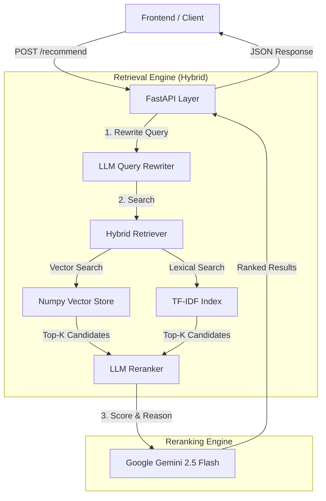
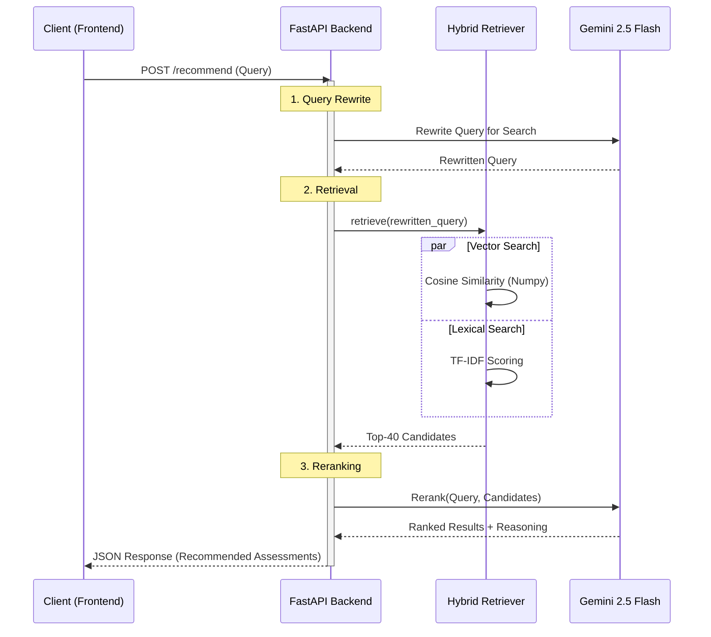

# Backend Architecture

This document outlines the architecture of the SHL Assessment Recommendation backend. The system is designed to provide high-relevance assessment recommendations by combining efficient hybrid retrieval with intelligent LLM-based reranking.

## System Overview

The backend follows a **"Retrieve & Rerank"** pattern. It first retrieves a broad set of candidates using a lightweight hybrid search (Vector + Lexical) and then refines the results using a powerful Large Language Model (LLM) to ensure the recommendations align perfectly with the user's specific requirements.

### Request Lifecycle (Sequence Diagram)

## Core Components

### 1. API Layer

- **Framework**: **FastAPI** is used for its high performance and native support for asynchronous operations.
- **Concurrency**: The `/recommend` endpoint is fully `async`, allowing the server to handle multiple concurrent requests without blocking, which is crucial for the I/O-bound operations involved in calling the LLM.
- **CORS**: Configured to allow cross-origin requests, enabling seamless integration with the Next.js frontend.

### 2. Retrieval Engine (Hybrid)

The retrieval layer is designed for speed and recall. It combines two search strategies to ensure no relevant candidates are missed.

- **Vector Search (Semantic)**:
  - **Model**: `BAAI/bge-small-en-v1.5` (384 dimensions).
  - **Storage**: **ChromaDB** is used during the build process to generate and manage embeddings.
  - **Runtime**: For the active deployment, embeddings are exported to **Numpy arrays**. This allows for extremely fast, lightweight cosine similarity calculations without the overhead of running a full vector database instance in memory.
- **Lexical Search (Keyword)**:
  - **Method**: TF-IDF (Term Frequency-Inverse Document Frequency) using `scikit-learn`.
  - **Purpose**: Captures exact keyword matches (e.g., "Java", "Excel") that semantic search might sometimes miss or dilute.
- **Scoring**:
  - Final Score = `0.75 * Vector_Score + 0.25 * Lexical_Score`.
  - **Metadata Boosting**: Additional boosts are applied for matches in `duration`, `job_level`, and `test_type`.

### 3. Reranking Engine (LLM)

The reranking layer provides the "intelligence" of the system.

- **Model**: **Google Gemini 2.5 Flash** (`gemini-2.5-flash`).
- **Logic**: The LLM evaluates the top retrieved candidates against the user's query. It assigns a relevance score (0-1) and provides a reasoning string for *why* a test was recommended.
- **Prompt Strategy**: The prompt enforces a weighted scoring system:
  - **Requirement Coverage (45%)**: Does the test meet all user needs?
  - **Skill Match (25%)**: Is the primary skill measured?
  - **Test Type (15%)**: Is the format appropriate (e.g., Coding vs. Personality)?
  - **Duration (10%)**: Is it within the time limit?
  - **Job Level (5%)**: Is it suitable for the seniority?

## Implementation Details

### Lazy Loading for Deployment

To optimize for deployment on **Render** (which often has strict memory limits on free/starter tiers), the `HybridRetriever` and other heavy components are **lazy-loaded**.

- They are not initialized at module import time.
- Instead, they are loaded into memory only upon the first request.
- This prevents the application from timing out during the boot phase ("Cold Start") and keeps memory usage low when the API is idle.

### Data Flow

1. **Request**: User sends a query (e.g., "Java developer test under 60 mins").
2. **Rewrite**: The LLM rewrites the query to be more search-friendly (e.g., "Java programming software engineering assessment duration:60m").
3. **Retrieve**: The Hybrid Retriever fetches the top 40 candidates based on vector and keyword similarity.
4. **Rerank**: The LLM analyzes these 40 candidates, scores them based on the weighted criteria, and selects the top matches.
5. **Response**: The API returns the ranked list with metadata, scores, and AI-generated reasoning.
